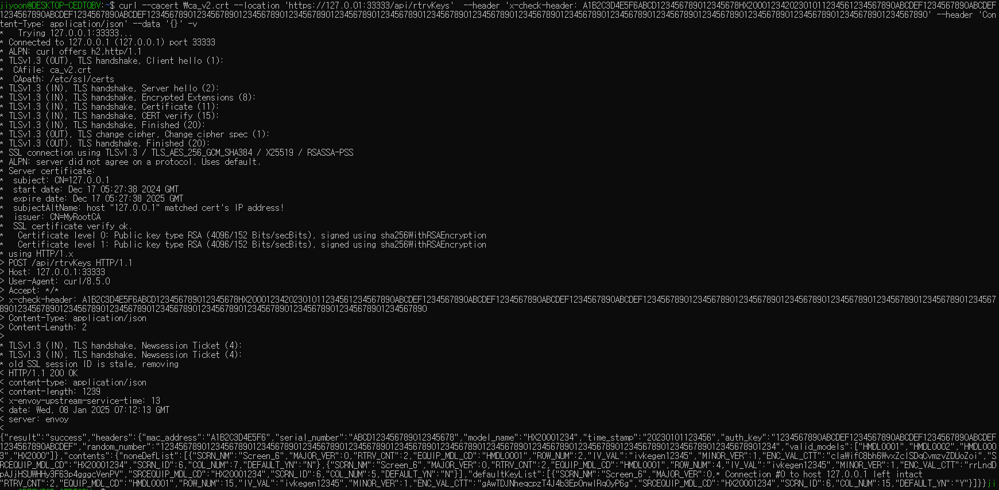
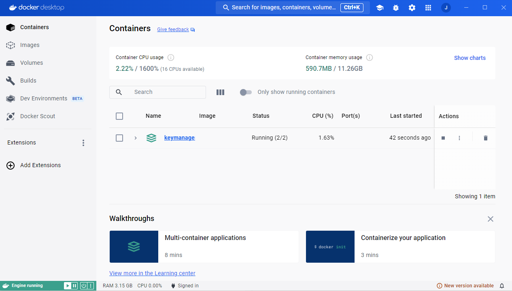
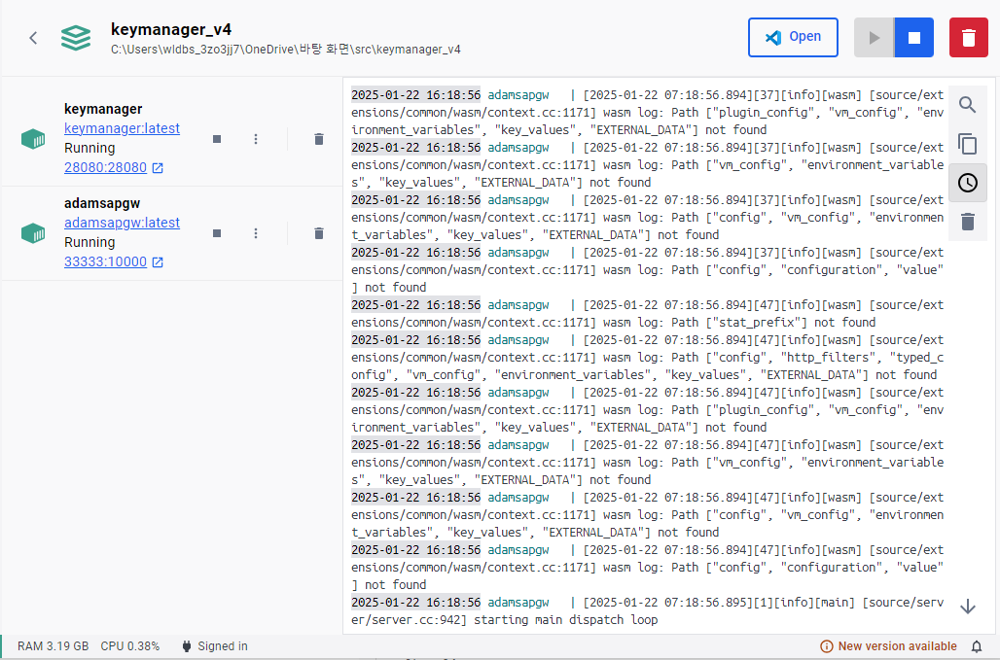
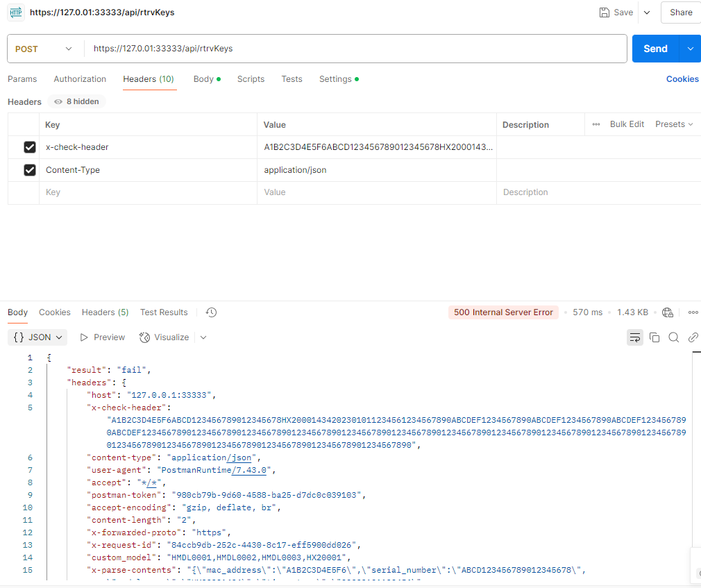
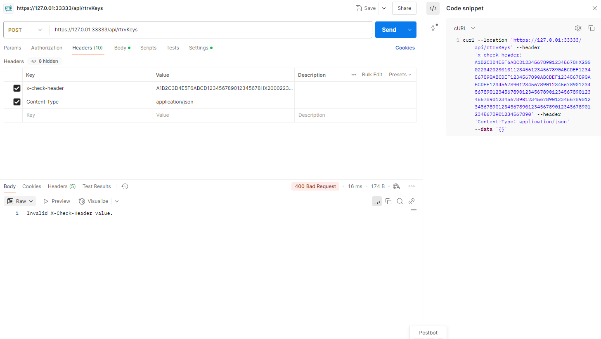
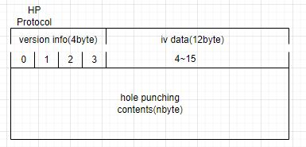
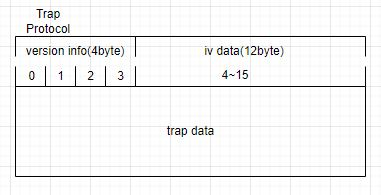
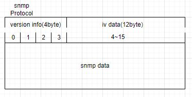
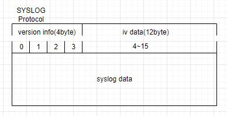

# 개요

> 이 문서는 Key Manager 서비스의 README로, AP와 ADAMS 간 암호화 키 전달을 위한 메시지 시뮬레이터의 설치 및 사용법을 설명합니다.

## 목차

1. [Message 흐름](#1-message-흐름)
2. [구성](#2-구성)
   * [2.1. Windows](#21-windows)
   * [2.2. Linux](#22-linux)
   * [2.3. 공통](#23-공통)
3. [설치 방법](#3-설치-방법)
   * [3.1. Docker container 의 image load](#31-docker-container-의-image-loadpowershell-linuxshell-동일)
   * [3.2. 설정 수정](#32-설정-수정)
   * [3.3. SQL의 모델 추가](#33-sql의-모델-추가)
   * [3.4. Docker Compose 실행 및 중지](#34-docker-compose-실행-및-중지)
4. [점검](#4-점검)
   * [4.1. 실행 확인](#41-실행-확인powershell-linuxshell-동일)
   * [4.2. 종료 확인](#42-종료-확인)
   * [4.3. service 테스트 방법](#43-service-테스트-방법)
      * [4.3.1. http 테스트](#431-http-테스트)
      * [4.3.2. https 테스트](#432-https-테스트)
   * [4.4. x-check-header](#44-x-check-header)
   * [4.5. 로그 및 에러 예시](#45-로그-및-에러-예시)
5. [장비 모델 추가 시나리오](#5-장비-모델-추가-시나리오)
6. [PACKET 구성](#6-packet-구성)
   * [6.1. 용어 정의](#61-용어-정의)
   * [6.2. HP Protocol](#62-hp-protocol)
   * [6.3. SNMP Trap Protocol](#63-snmp-trap-protocol)
   * [6.4. SNMP Protocol](#64-snmp-getsetwalkprotocol)
   * [6.5. SYSLOG](#65-syslog)
7. [참고 자료](#7-참고-자료)
8. [TO DO](#8-to-do)


### 1. Message 흐름


### 2. 구성

#### 2.1. Windows

1. 설치 스크립트
	1. HTTP 서비스
		1. 기동: start-docker-compose.ps1
		2. 중지: stop-docker-compose.ps1
	2. TLS 서비스
		1. 기동: start-docker-compose_ssl.ps1
		2. 중지 : 중지: stop-docker-compose_ssl.ps1

#### 2.2. Linux 

1. 설치 스크립트
	1. HTTP 서비스
		1. 기동: start-docker-compose.sh
		2. 중지: stop-docker-compose.sh
	2. TLS 서비스
		1. 기동: start-docker-compose_ssl.sh
		2. 중지 : stop-docker-compose_ssl.sh

#### 2.3. 공통

1. Docker 컨테이너 이미지
	1. gateway : adamsapgw.tar
	2. keymanager : keymanager.tar
2. Docker Compose 파일
	1. docker-compose.yml (HTTP 서비스)
    : VALID_MODELS, SERVICE_IP, SERVICE_PORT (수정 필요)
	2. docker-compose_ssl.yml (HTTPS 서비스)
    : VALID_MODELS, SERVICE_IP, SERVICE_PORT (수정 필요)

-  docker-compose.yml,  docker-compose_ssl.yml 수정 대상 Sample
``` yaml
version: '3.8'
....
      - ${serverca}:/etc/envoy/certs/ca.crt  # 볼륨 매핑
    environment:
      - VALID_MODELS=HMDL0001,HMDL0002,HMDL0003  # CHECK 대상이되는 AP 모델을 적용(각각 수정사용)
      - SERVICE_IP=192.168.0.45 # 서비스 ip  (수정필요 host ip)
      - SERVICE_PORT=28080      # 서비스 port
    networks:
      - app_network
    depends_on:
      - keymanager
......

```
4. config

	1.envoy.yaml: HTTP 서비스 구성 파일. 클러스터의 SERVICE IP와 포트를 환경에 맞게 수정.
	2.envoy_ssl.yaml: HTTPS 서비스 구성 파일. 클러스터의 IP와 포트를 환경에 맞게 수정.

``` yaml 
...... 
 clusters:
  - name: backend
    connect_timeout: 5s
    type: LOGICAL_DNS
    lb_policy: ROUND_ROBIN
    # 헬스 체크를 제거하거나 비활성화
    load_assignment:
      cluster_name: backend_service
      endpoints:
        - lb_endpoints:
            - endpoint:
                address:
                  socket_address:
                  # docker 의 ip 확인필요 (아래의 내용을 변경)
                    address: "192.168.0.45"
                    port_value: 28080
................
```

5. 인증서
	1. /config/certs 경로에 배치된 사설 인증서 사용. (SSL 인증서 생성 참조 하여 생성해서 사용 하여도 됨.  [ssl 인증서 생성](<SSL 인증서 생성.md>))

6. SQL
	1. schema.sql: 키 정보를 초기화하기 위한 SQL 스크립트로,  테스트 하고자 하는 모델을 SCRN_MDL_INFO 테이블에 추가해야 합니다.	   
``` sql
-- EQUIP_MDL_CD (test 시 임의 생성 가능)
-- SRCEQUIP_MDL_CD (header 전문에서사용하는 MODEL정보(10) : EQUIP_MDL_CD는 AP 모델 코드(예: HX20001)이며,EQUIP_MDL_CD이 총 10자리가 되지 않을 경우 임의의 코드나 규칙으로 채워서 SRCEQUIP_MDL_CD를 생성합니다.)
-- AUDIT_ID (system)
-- AUDIT_DTM(create time)
-- SCRN_ID(SEC_SCREEN_INFO 의 SCRN_ID 해당 SCRN_ID 스크린당 10개씩선택 되도록 되어 있음) 
-- EXPIRE_DT (미구현,ToDo 임의의 날짜입력)
-- 스크린당 몇개의 key 만 보여줄건지에 대한 내용. (2+1(default))

INSERT INTO SCRN_MDL_INFO (EQUIP_MDL_CD,SRCEQUIP_MDL_CD,AUDIT_ID,AUDIT_DTM,SCRN_ID,EXPIRE_DT,RTRV_CNT,ADD_TXT_VAL) VALUES
	 ('HMDL0001','HMDL000123','system','2024-12-07 10:32:56',6,'20251207',2,'')

```
---
### 3. 설치 방법

* 도커 설치([도커 설치](https://docs.docker.com/desktop/)) 및 root 계정이라는 가정하에 진행

#### 3.1. Docker container 의 image load(powershell, linuxshell) 동일

``` powershell

> docker load -i adamsapgw.tar  # adamsapgw 도커 이미지 로드 (root 계정이 아닐 시 sudo)
## 만약 adamsapgw:latest 찾아지지 않으면
> docker images # none 로 되어있는 image 를 확인함
> docker tag ${IMAGE_ID} adamsapgw:latest   # none 로 되어있는 경우만

> docker load -i keymanager.tar  # keymanager 도커 이미지 로드
## 만약 adamsapgw:latest 찾아지지 않으면
> docker images # none 로 되어있는 image 를 확인함
> docker tag ${IMAGE_ID} keymanager:latest   # none 로 되어있는 경우만

> docker images

### 실행결과
REPOSITORY                      TAG       IMAGE ID       CREATED         SIZE \
keymanager                      latest    81704407beae   5 days ago      939MB\
adamsapgw                       latest    1f643a17c530   5 weeks ago     350MB

```

#### 3.2. 설정 수정
	1. docker-compose.yml 및 docker-compose_ssl.yml에서 SERVICE_IP와 SERVICE_PORT 수정 및 VALID_MODELS 값을 수정하여 모델 추가.
	2. config directory 의 envoy.yaml 및 envoy_ssl.yaml에서 클러스터 주소(address)와 포트 수정.

#### 3.3. SQL의 모델 추가
	schema.sql 파일 SCRN_MDL_INFO 테이블에 테스트 모델 추가

``` sql
-- 스크린 모델 정보 
INSERT INTO SCRN_MDL_INFO (EQUIP_MDL_CD,SRCEQUIP_MDL_CD,AUDIT_ID,AUDIT_DTM,SCRN_ID,EXPIRE_DT,RTRV_CNT,ADD_TXT_VAL) VALUES
	 ('HMDL0001','HMDL000123','system','2024-12-07 10:32:56',6,'20251207',2,''),
	 ('HMDL0002','HMDL0002','system','2024-12-07 10:32:56',0,'20251207',2,''),
	 ('HMDL0003','HMDL0003','system','2024-12-07 10:32:56',8,'20251207',2,''),
	 ('HMDL0004','HMDL0004','system','2024-12-07 10:32:56',8,'20251207',2,''),
	 ('HMDL0005','HMDL0005','system','2024-12-07 10:32:56',3,'20251207',2,''),
	 ('HX20001','HX20001234','system','2024-12-07 10:32:56',2,'20251207',2,'');
```

#### 3.4. Docker Compose 실행 및 중지
  * PowerShell 관리자 권한으로 실행:

``` powershell
# 관리자 모드로 실행
Set-ExecutionPolicy RemoteSigned
Set-ExecutionPolicy -ExecutionPolicy Bypass -Scope Process
.\start-docker-compose.ps1  # http 서비스 실행
.\stop-docker-compose.ps1   # http 서비스 중지
.\start-docker-compose_ssl.ps1  # https 서비스 실행
.\stop-docker-compose_ssl.ps1   # https 서비스 중지

```
  * linuxshell 실행:
  
``` shell
#root 계정이 아닐 시 shell 사용 권한
chmod 755 ${keymanagerhome}/keymanager_v3/start-docker-compose_ssl.sh
chmod 755 ${keymanagerhome}/keymanager_v3/stop-docker-compose_ssl.sh
chmod 755 ${keymanagerhome}/keymanager_v3/start-docker-compose.sh
chmod 755 ${keymanagerhome}/keymanager_v3/stop-docker-compose.sh
#root 계정이 아닐 시 모든 shell 파일 사용 권한 
chmod 755 ${keymanagerhome}/keymanager_v3/*.sh

.\start-docker-compose.sh  # http 서비스 실행
.\stop-docker-compose.sh   # http 서비스 중지
.\start-docker-compose_ssl.sh  # https 서비스 실행
.\stop-docker-compose_ssl.sh   # https 서비스 중지
```
---
### 4. 점검

#### 4.1. 실행 확인(powershell, linuxshell) 동일
``` powershell

PS C:\PROJECT\package\keymanager> ./start-docker-compose.ps1
Access Log Path: C:\PROJECT\package\keymanager/logs/accesslog.log
Key Manager Log Path: C:\PROJECT\package\keymanager/logs
GW Config Path: C:\PROJECT\package\keymanager/config/envoy.yaml
Server CRT Path: C:\PROJECT\package\keymanager/config/certs/server.crt
Server KEY Path: C:\PROJECT\package\keymanager/config/certs/server.key
Server CA Path: C:\PROJECT\package\keymanager/config/certs/ca.crt
[+] Running 2/3
 - Network keymanager_app_network  Created                                                                         1.0s
 ✔ Container keymanager            Started                                                                         0.5s
 ✔ Container adamsapgw             Started                                                                         0.9s

```

#### 4.2. 종료 확인
``` powershell

PS C:\PROJECT\package\keymanager> ./stop-docker-compose.ps1
Access Log Path: C:\PROJECT\package\keymanager/logs/accesslog.log
Key Manager Log Path: C:\PROJECT\package\keymanager/logs
GW Config Path: C:\PROJECT\package\keymanager/config/envoy_ssl.yaml
Server CRT Path: C:\PROJECT\package\keymanager/config/certs/server.crt
Server KEY Path: C:\PROJECT\package\keymanager/config/certs/server.key
Server CA Path: C:\PROJECT\package\keymanager/config/certs/ca.crt
[+] Running 3/3
 ✔ Container adamsapgw             Removed                                                                         0.3s
 ✔ Container keymanager            Removed                                                                         2.4s
 ✔ Network keymanager_app_network  Removed

```

#### 4.3. service 테스트 방법
#### 4.3.1. http 테스트
- req
``` bash
curl --location 'http://127.0.0.1:33333/api/rtrvKeys' \

--header 'x-check-header: A1B2C3D4E5F6ABCD123456789012345678HX20001234202301011234561234567890ABCDEF1234567890ABCDEF1234567890ABCDEF1234567890ABCDEF12345678901234567890123456789012345678901234567890123456789012345678901234567890123456789012345678901234567890123456789012345678901234567890123456789012345678901234567890' \

--header 'Content-Type: application/json' \

--data '{}'
```

- res 
``` json

{
    "result": "success",
    "headers": {
        "serial_number": "ABCD123456789012345678",
        "time_stamp": "20230101123456",
        "mac_address": "A1B2C3D4E5F6",
        "model_name": "HX20001234",
        "auth_key": "1234567890ABCDEF1234567890ABCDEF1234567890ABCDEF1234567890ABCDEF",
        "random_number": "12345678901234567890123456789012345678901234567890123456789012345678901234567890123456789012345678901234567890123456789012345678901234",
        "valid_models": [
            ""
        ]
    },
    "contents": {
        "noneDefList": [
            {
                "SCRN_NM": "Screen_6",
                "MAJOR_VER": 0,
                "RTRV_CNT": 2,
                "EQUIP_MDL_CD": "HMDL0001",
                "ROW_NUM": 2,
                "IV_VAL": "ivkegen12345",
                "MINOR_VER": 1,
                "ENC_VAL_CTT": "claWifC8bh6WvxZclSDqCvmzvZDUoZoi",
                "SRCEQUIP_MDL_CD": "HX20001234",
                "SCRN_ID": 6,
                "COL_NUM": 7,
                "DEFAULT_YN": "N"
            },
            {
                "SCRN_NM": "Screen_6",
                "MAJOR_VER": 0,
                "RTRV_CNT": 2,
                "EQUIP_MDL_CD": "HMDL0001",
                "ROW_NUM": 11,
                "IV_VAL": "ivkegen12345",
                "MINOR_VER": 1,
                "ENC_VAL_CTT": "qTA5CvZJE4YKhWT6zwAKjoxpD9tzYXse",
                "SRCEQUIP_MDL_CD": "HX20001234",
                "SCRN_ID": 6,
                "COL_NUM": 8,
                "DEFAULT_YN": "N"
            }
        ],
        "defaultKeyList": [
            {
                "SCRN_NM": "Screen_6",
                "MAJOR_VER": 0,
                "RTRV_CNT": 2,
                "EQUIP_MDL_CD": "HMDL0001",
                "ROW_NUM": 15,
                "IV_VAL": "ivkegen12345",
                "MINOR_VER": 1,
                "ENC_VAL_CTT": "gAwTDJNheqcpzT4J4b3EpOnwlRq0yP6g",
                "SRCEQUIP_MDL_CD": "HX20001234",
                "SCRN_ID": 6,
                "COL_NUM": 15,
                "DEFAULT_YN": "Y"
            }
        ]
    }
}

```
- 응답 메세지 필드설명

| 필드명              | 내용  |  
| ---------------- | --- |
| **result**        | 성공여부 ( "success" / "fail")     |
| **headers** | 요청했던 헤더내용 |
| **serial_number** | 시리얼 넘버       |
| **time_stamp**    | 요청시간       |
| **mac_address**    | MAC주소        |
| **model_name**    | 소스모델코드       |
| **auth_key**      | 인증키          |
| **random_number** | 자릿수 채우기용 랜덤숫자      |
| **valid_models** | 허용된 모델코드     |

- 응답 메세지 필드설명 (컨텐츠)

| 필드명              | 내용  |
| ---------------- | --- |
| **noneDefList** | 기본키를 제외한 키값 (스크린 모델 테이블의 RTRV_CNT만큼 전송)  |
| **defaultKeyList** | 기본키값  | 
| **SCRN_NM** | 스크린명  |
| **MAJOR_VER** | 메이저버전  |
| **RTRV_CNT** | 조회결과수(전송할 키갯수)  |
| **EQUIP_MDL_CD** | 모델코드  |
| **ROW_NUM** | 행 번호  |
| **IV_VAL** | IV값  |
| **MINOR_VER** | 마이너버전전  |
| **ENC_VAL_CTT** | 암호화값  |
| **SRCEQUIP_MDL_CD** | 소스모델코드  |
| **SCRN_ID** | 스크린 ID  |
| **COL_NUM** | 열 번호  |
| **DEFAULT_YN** | 기본키 여부  |


#### 4.3.2. https 테스트
   - Curl로 테스트(WSL,리눅스)
```bash
    curl --location \
  --cacert "ca.crt" \
  --request POST "https://127.0.0.1:33333/api/rtrvKeys" \
  --header "x-check-header: A1B2C3D4E5F6ABCD123456789012345678HX20001234202301011234561234567890ABCDEF1234567890ABCDEF1234567890ABCDEF1234567890ABCDEF12345678901234567890123456789012345678901234567890123456789012345678901234567890123456789012345678901234567890123456789012345678901234567890123456789012345678901234567890" \
  --header "Content-Type: application/json" \
  --data '{}' -v
```


   - Postman으로 테스트
      - CA 인증서 추가:
        Postman 설정에서 Certificates 탭에 ca.crt 추가.
      - SSL 인증 활성화:
        Postman 설정에서 SSL Certificate Verification 옵션 활성화.
      - 요청 설정:
        URL: https://127.0.0.1:33333/api/rtrvKeys
        Method: POST
        Headers: x-check-header 포함.
        Body: {} (JSON).
      - 요청 및 응답 예시
- req
```bash
curl --location 'http://127.0.0.1:33333/api/rtrvKeys' \
  --header 'x-check-header: A1B2C3D4E5F6ABCD123456789012345678HX20001234202301011234561234567890ABCDEF1234567890ABCDEF1234567890ABCDEF1234567890ABCDEF12345678901234567890123456789012345678901234567890123456789012345678901234567890123456789012345678901234567890123456789012345678901234567890123456789012345678901234567890' \
  --header 'Content-Type: application/json' \
  --data '{}'
``` 
- res 
```json
{
    "result": "success",
    "headers": {
        "serial_number": "ABCD123456789012345678",
        "time_stamp": "20230101123456",
        "mac_address": "A1B2C3D4E5F6",
        "model_name": "HX20001234",
        "auth_key": "1234567890ABCDEF1234567890ABCDEF1234567890ABCDEF1234567890ABCDEF",
        "random_number": "12345678901234567890123456789012345678901234567890123456789012345678901234567890123456789012345678901234567890123456789012345678901234",
        "valid_models": [
            ""
        ]
    },
    "contents": {
        "noneDefList": [
            {
                "SCRN_NM": "Screen_6",
                "MAJOR_VER": 0,
                "RTRV_CNT": 2,
                "EQUIP_MDL_CD": "HMDL0001",
                "ROW_NUM": 2,
                "IV_VAL": "ivkegen12345",
                "MINOR_VER": 1,
                "ENC_VAL_CTT": "claWifC8bh6WvxZclSDqCvmzvZDUoZoi",
                "SRCEQUIP_MDL_CD": "HX20001234",
                "SCRN_ID": 6,
                "COL_NUM": 7,
                "DEFAULT_YN": "N"
            },
            {
                "SCRN_NM": "Screen_6",
                "MAJOR_VER": 0,
                "RTRV_CNT": 2,
                "EQUIP_MDL_CD": "HMDL0001",
                "ROW_NUM": 11,
                "IV_VAL": "ivkegen12345",
                "MINOR_VER": 1,
                "ENC_VAL_CTT": "qTA5CvZJE4YKhWT6zwAKjoxpD9tzYXse",
                "SRCEQUIP_MDL_CD": "HX20001234",
                "SCRN_ID": 6,
                "COL_NUM": 8,
                "DEFAULT_YN": "N"
            }
        ],
        "defaultKeyList": [
            {
                "SCRN_NM": "Screen_6",
                "MAJOR_VER": 0,
                "RTRV_CNT": 2,
                "EQUIP_MDL_CD": "HMDL0001",
                "ROW_NUM": 15,
                "IV_VAL": "ivkegen12345",
                "MINOR_VER": 1,
                "ENC_VAL_CTT": "gAwTDJNheqcpzT4J4b3EpOnwlRq0yP6g",
                "SRCEQUIP_MDL_CD": "HX20001234",
                "SCRN_ID": 6,
                "COL_NUM": 15,
                "DEFAULT_YN": "Y"
            }
        ]
    }
}

```

#### 4.4. x-check-header

| 필드명              | 길이  | 정규식              |     |
| ---------------- | --- | ---------------- | --- |
| **MacAddress**   | 12  | `^[0-9A-F]{12}$` |     |
| **SerialNumber** | 22  | `^[A-Z0-9]{22}$` |     |
| **ModelName**    | 10  | SRCEQUIP_MDL_CD  |     |
| **TimeStamp**    | 14  | 길이만 검증           |     |
| **AuthKey**      | 64  | 길이만 검증           |     |
| **RandomNumber** | 134 | 길이만 검증           |     |

- 예시 1: 통과 실패
  - 헤더 전달 값: SRCEQUIP_MDL_CD = HX20001234
  - VALID_MODELS: HMDL0001, HMDL0002, HMDL0003
  - 결과: VALID_MODELS에 HX20001이 없으므로 유효성 검증 실패.

- 예시 2: 통과 성공
  - 헤더 전달 값: SRCEQUIP_MDL_CD = HX20001234
  - VALID_MODELS: HMDL0001, HMDL0002, HMDL0003, HX20001
  - 결과: HX20001이 VALID_MODELS에 있으므로 유효성 검증 통과.

#### 4.5. 로그 및 에러 예시 
1. docker 실행 후 상세 로그 확인 방법
  1. docker desktop 로그 확인 : 도커 데스크탑 keymanage 컨테이너 Name 클릭 시 상세로그 확인 가능
  
  
  2. 리눅스에서 실행 후 상세로그 확인 
```shell
sudo docker ps -a

docker logs <CONTAINER ID>
```
2. test 시 많이 발생하는 에러
  1.  test 시 docker-compose.yml , config/envoy.yaml config파일에 ip를 해당 docker ip 맞게 수정하지 않을 시 503 에러
```yaml
# docker-compose.yml => - SERVICE_IP=192.168.0.45 docker ip 맞게 수정
version: '3.8'

services:
  adamsapgw:
    image: adamsapgw:latest
    container_name: adamsapgw
    ports:
      - "33333:10000"  # 호스트 포트 8080을 컨테이너의 8080 포트에 매핑
    volumes:
      - ${accesslog}:/var/log/envoy/access.log  # 볼륨 매핑
      #- ${gwconfig}:/etc/envoy/envoy.yaml  # 볼륨 매핑
      - ${servercrt}:/etc/envoy/certs/server.crt  # 볼륨 매핑
      - ${serverkey}:/etc/envoy/certs/server.key  # 볼륨 매핑
      - ${serverca}:/etc/envoy/certs/ca.crt  # 볼륨 매핑
    environment:
      - USE_TLS=N
      - VALID_MODELS=HMDL0001,HMDL0002,HMDL0003,HX20001  # 환경 변수 설정
      - SERVICE_IP=192.168.0.45
      - SERVICE_PORT=28080
 
------
# envoy.yaml => address: "192.168.0.45" docker ip 맞게 수정

  clusters:
  - name: backend
    connect_timeout: 5s
    type: LOGICAL_DNS
    lb_policy: ROUND_ROBIN
    # 헬스 체크를 제거하거나 비활성화
    load_assignment:
      cluster_name: backend_service
      endpoints:
        - lb_endpoints:
            - endpoint:
                address:
                  socket_address:
                  # docker 의 ip 확인필요
                    address: "192.168.0.45"
                    port_value: 28080
```

  2. https 요청 시 ssl ca cert 인증서 경로 잘못 입력 500 에러
```bash
curl --location \
--cacert "config/certs/ca.crt" \
--request POST "https://127.0.0.1:33333/api/rtrvKeys" \
--header "x-check-header: A1B2C3D4E5F6ABCD123456789012345678HX20001234202301011234561234567890ABCDEF1234567890ABCDEF1234567890ABCDEF1234567890ABCDEF12345678901234567890123456789012345678901234567890123456789012345678901234567890123456789012345678901234567890123456789012345678901234567890123456789012345678901234567890" \
  --header "Content-Type: application/json" \
  --data '{}' -v
```

  3. 데이터베이스에 존재하지 않는 모델 헤더에 입력 시
  
  4. x-check-header 헤더 체크 실패 시 
  : 유효 모델이 아닐 경우 등
  

### 5. 장비 모델 추가 시나리오
1. start-docker-compose : docker compose 실행 파일 환경변수 경로에 있는 sql 파악
```yml
$bizbase = "$(pwd)"
$env:sql = "$bizbase/sql/schema.sql"
```

2. 해당 schema.sql 파일에 모델 추가
```sql
-- 스크린 모델 정보
INSERT INTO SCRN_MDL_INFO (EQUIP_MDL_CD,SRCEQUIP_MDL_CD,AUDIT_ID,AUDIT_DTM,SCRN_ID,EXPIRE_DT,RTRV_CNT,ADD_TXT_VAL) VALUES
         ('HMDL0001','HMDL000123','system','2024-12-07 10:32:56',6,'20251207',2,''),
         ('HMDL0002','HMDL0002','system','2024-12-07 10:32:56',0,'20251207',2,''),
         ('HMDL0003','HMDL0003','system','2024-12-07 10:32:56',8,'20251207',2,''),
         ('HMDL0004','HMDL0004','system','2024-12-07 10:32:56',8,'20251207',2,''),
         ('HMDL0005','HMDL0005','system','2024-12-07 10:32:56',3,'20251207',2,''),
         ('HX20001','HX20001234','system','2024-12-07 10:32:56',2,'20251207',2,'');
```

- SCRN_ID : 스크린정보 테이블에 존재하는 SCRN_ID 삽입
- EQUIP_MDL_CD : 원하는 테스트 장비 모델 코드 
- SRCEQUIP_MDL_CD : header 전문에서사용하는 MODEL정보(10) : EQUIP_MDL_CD는 AP 모델 코드(예: HI245200)이며,EQUIP_MDL_CD이 총 10자리가 되지 않을 경우 임의의 코드나 규칙으로 채워서 SRCEQUIP_MDL_CD(예 : HI24520000)를 생성
- RTRV_CNT : /api/rtrvKeys 요청 시 응답 내용 중 기본 스크린(defaultkeyList) 제외한 반환하는 암호화키의 개수(noneDefList 리스트 요소의 개수)
- AUDIT_ID : 작업자 ID 
- AUDIT_DTM : 작업일자
- EXPIRE_DT : 만료일자 
- ADD_TXT_VAL : 부가정보

스크린 모델 추가 시 EX)

| EQUIP_MDL_CD | SRCEQUIP_MDL_CD | AUDIT_ID | AUDIT_DTM           | SCRN_ID | EXPIRE_DT | RTRV_CNT | ADD_TXT_VAL |
| ------------ | --------------- | -------- | ------------------- | ------- | --------- | -------- | ----------- |
| HI245200     | HI24520000      | system   | 2024-12-07 10:32:56 | 1       | 20251207  | 3        |             |
```sql
-- 스크린 모델 정보
INSERT INTO SCRN_MDL_INFO (EQUIP_MDL_CD,SRCEQUIP_MDL_CD,AUDIT_ID,AUDIT_DTM,SCRN_ID,EXPIRE_DT,RTRV_CNT,ADD_TXT_VAL) VALUES
         ('HMDL0001','HMDL000123','system','2024-12-07 10:32:56',6,'20251207',2,''),
         ('HMDL0002','HMDL0002','system','2024-12-07 10:32:56',0,'20251207',2,''),
         ('HMDL0003','HMDL0003','system','2024-12-07 10:32:56',8,'20251207',2,''),
         ('HMDL0004','HMDL0004','system','2024-12-07 10:32:56',8,'20251207',2,''),
         ('HMDL0005','HMDL0005','system','2024-12-07 10:32:56',3,'20251207',2,''),
         ('HX20001','HX20001234','system','2024-12-07 10:32:56',2,'20251207',2,''),
         ('HI245200','HI24520000','system','2024-12-07 10:32:56',1,'20251207',3,'');
```

: ('HI245200','HI24520000','system','2024-12-07 10:32:56',1,'20251207',3,'') 추가 후 저장 
.png>)

3. docker-compose.yml , docker-compose_ssl.yml 파일 수정 
: docker-compose.yml , docker-compose_ssl.yml 파일 환경변수 VALID_MODELS에 모델 추가
```yml
 environment:
      - USE_TLS=N
      - VALID_MODELS=HMDL0001,HMDL0002,HMDL0003,HX20001,HI245200  # 환경 변수 설정
```
.png>)

4. 재실행 및 실행
```bash
#재실행 
./stop-docker-compose_ssl.sh
./start-docker-compose_ssl.sh
#실행 
./start-docker-compose_ssl.sh
```
6. 추가한 모델 test 
: https 예시
```bash
curl --location \
--cacert "config/certs/ca.crt" \
--request POST "https://127.0.0.1:33333/api/rtrvKeys" \
--header "x-check-header: A1B2C3D4E5F6ABCD123456789012345678HI24520000202301011234561234567890ABCDEF1234567890ABCDEF1234567890ABCDEF1234567890ABCDEF12345678901234567890123456789012345678901234567890123456789012345678901234567890123456789012345678901234567890123456789012345678901234567890123456789012345678901234567890" \
  --header "Content-Type: application/json" \
  --data '{}' -v
```


.png>)
위에서 보이는 것과 같이 'RTRV_CNT : /api/rtrvKeys 요청 시 응답 내용 중 기본 스크린(defaultkeyList) 제외한 반환하는 암호화키의 개수(noneDefList 리스트 요소의 개수)'  기본을 제외하고 스크린 모델 추가한 것과 같이 3개를 반환

### 6. PACKET 구성 
- ADAMS 와 AP 구간의 Protocol 별 Packet 의 구성을 정의 한다.

#### 6.1. 용어 정의
- iv : 초기화백터(initialize vector)
- HP: hole punching
- version info : 암호화 버전
	1. 0 : Major version(0~255)
	2. 1 : Minor version(0~255)
	3. 2 : ROW (0~15)
	4. 3 : CON (0~15)

#### 6.2. HP Protocol
- 암호화 Hole Punching 의 Protocol 의 구성.
- iv 문자 범위 : ABCDEFGHIJKLMNOPQRSTUVWXYZabcdefghijklmnopqrstuvwxyz0123456789
- HP Protocol 구성 



#### 6.3. SNMP Trap Protocol
- 암호화 SNMP Trap 프로토콜 구성



#### 6.4. SNMP (GET/SET/WALK)Protocol
- 암호화 SNMP 프로토콜 구성



#### 6.5. SYSLOG
- 암호화 SYSLOG 프로토콜 구성



### 7. 참고 자료
1. [AES 256 암호화](README2_AES256.md) AES 256 암호화 방법 설명
2. [API 명세](README_API.md) API 명세 및 HTTP ERROR CODE
3. [ssl 인증서 생성](<SSL 인증서 생성.md>)
  : config/certs/인증서 관련 오류 시 인증서 직접 생성하여 인증서 교체 후 실행할 수 있도록 설명되어 있는 readme 자료
4. [key Table](README_KEY_TABLE.md) Key 를 관리하는 Table을 설명


### 8. TO DO 

1. sha256 checksum 추가 현 bypass
2. api 추가 요청 수용, 처리