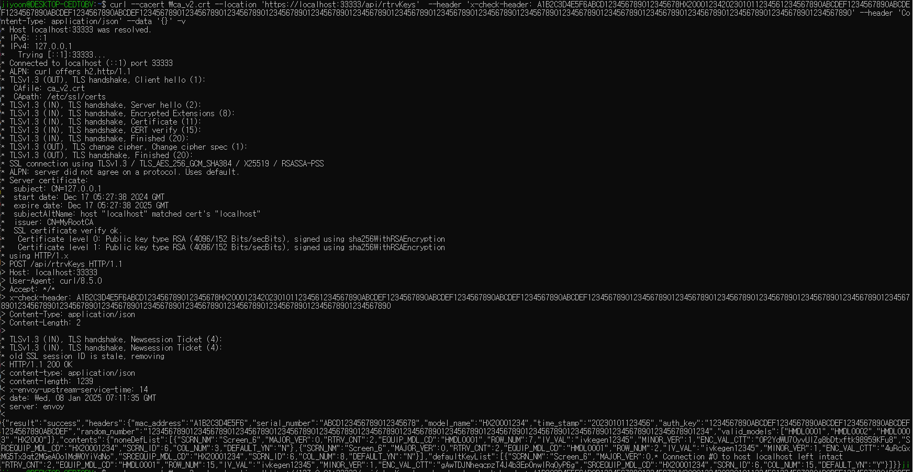
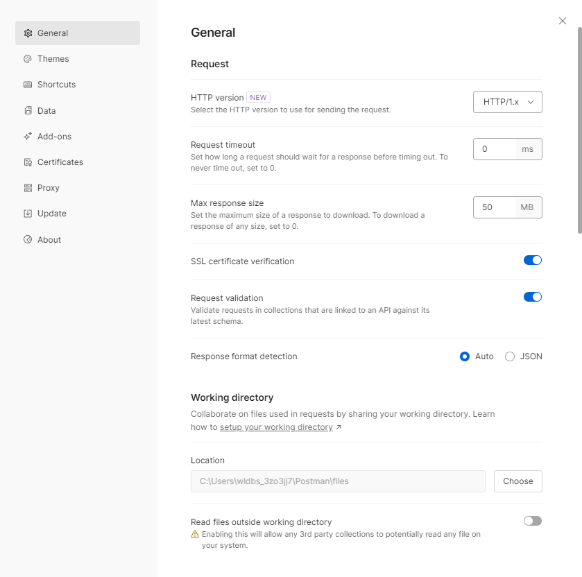
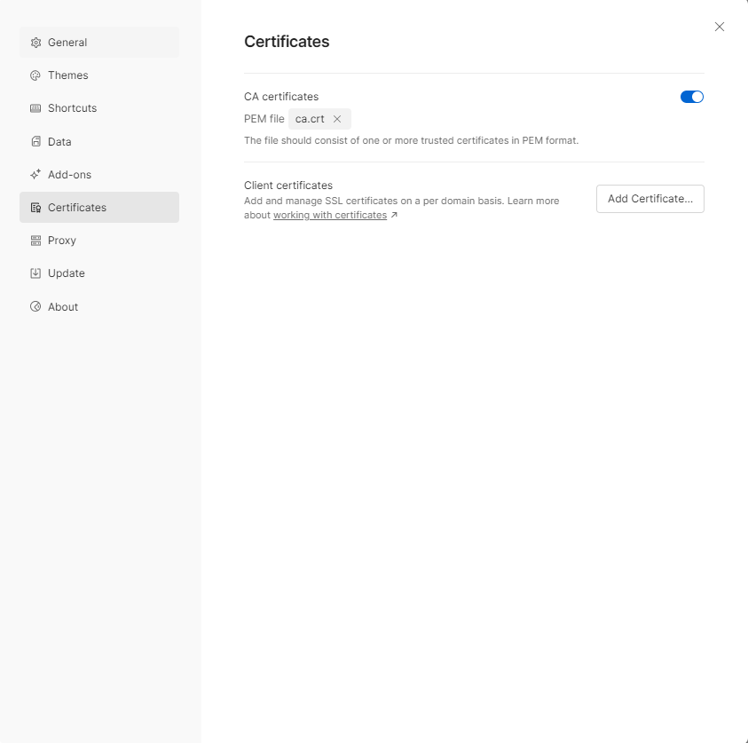
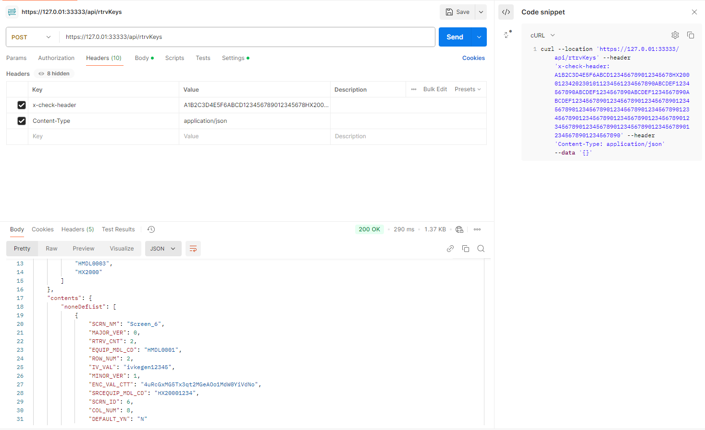

## SSL 인증서 생성

## 목차
    1. 사설 인증서 생성 방법
        1.1 openssl 설치 확인
        1.2 Root CA (ca.crt) 생성
        1.3 서버 인증서 (server.crt)와 키 (server.key) 생성
        1.4 최종 파일
        1.5 테스트 방법

### 사설 인증서 생성 방법

1. openssl 설치 확인 
- Windows: OpenSSL 다운로드
- Linux/Mac: 기본으로 포함되거나 sudo apt install openssl 또는 brew install openssl로 설치합니다.

```bash
openssl version
```

2. Root CA (ca.crt) 생성

- Step 1: Root CA 키 파일 생성
```bash
openssl genrsa -out ca.key 4096
``` 
    ca.key: Root CA의 개인 키

- Step 2: Root CA 인증서 생성
```bash
openssl req -x509 -new -nodes -key ca.key -sha256 -days 3650 -out ca.crt -subj "/CN=MyRootCA"
```
    -x509: 자체 서명된 인증서 생성
    -days 3650: 유효기간 10년
    -out ca.crt: 생성된 Root CA 인증서

3. 서버 인증서 (server.crt)와 키 (server.key) 생성

- Step 3: 서버 키 생성
```bash
openssl genrsa -out server.key 4096
```
    server.key: 서버의 개인 키

- Step 4: 서버 인증서 서명 요청 (CSR) 생성
```bash
openssl req -new -key server.key -out server.csr -subj "/CN=127.0.0.1"
```
    -subj "/CN=127.0.0.1": 서버의 Common Name을 설정 (127.0.0.1 또는 도메인)

- Step 5: 서버 인증서 서명 (Root CA로 서명)

리눅스환경 , cmd창
```bash
echo subjectAltName = IP:127.0.0.1, DNS:localhost > san.cnf
openssl x509 -req -in server.csr -CA ca.crt -CAkey ca.key -CAcreateserial -out server.crt -days 365 -sha256 -extfile san.cnf
```
powershell환경
:san.cnf 파일을 생성하여 확장 옵션(Subject Alternative Name)을 설정할 때 사용
```powershell
Set-Content -Path "san.cnf" -Value "subjectAltName = IP:127.0.0.1, DNS:localhost"
openssl x509 -req -in server.csr -CA ca.crt -CAkey ca.key -CAcreateserial -out server.crt -days 365 -sha256 -extfile san.cnf
```
    server.csr: 서버의 CSR 파일
    -CA ca.crt -CAkey ca.key: Root CA의 인증서와 키로 서명
    -days 365: 서버 인증서 유효기간
    subjectAltName: IP 주소와 DNS 이름 지정

4. 최종 파일

생성된 파일들:
ca.crt → Root CA 인증서
server.crt → 서버 인증서
server.key → 서버 개인 키

5. 인증서 및 서버 설정 변경  
- 생성된 인증서로 변경
/config/certs 경로에 
생성된 파일들:
ca.crt → Root CA 인증서
server.crt → 서버 인증서
server.key → 서버 개인 키
해당 파일 이동

- 인증서 파일 이름 변경 시 서버 설정 변경
start-docker-compose_ssl.ps1 파일에 해당 인증서 파일 이름으로 수정
```
#gw config
$env:accesslog = "$bizbase/logs/accesslog.log"
$env:gwconfig = "$gwbase/envoy_ssl.yaml"
$env:servercrt = "$gwbase/certs/server.crt"
$env:serverkey = "$gwbase/certs/server.key"
$env:serverca = "$gwbase/certs/ca.crt"
```
예 
ca2.crt → Root CA 인증서
server2.crt → 서버 인증서
server2.key → 서버 개인 키
```
#gw config
$env:accesslog = "$bizbase/logs/accesslog.log"
$env:gwconfig = "$gwbase/envoy_ssl.yaml"
$env:servercrt = "$gwbase/certs/server2.crt"
$env:serverkey = "$gwbase/certs/server2.key"
$env:serverca = "$gwbase/certs/ca2.crt"
```


5. 테스트 방법

** (1). wsl 환경에서 curl 명령으로 테스트

위에서 생성한 ca.crt를 사용하여 curl 요청을 보냅니다.

```bash
curl --location \
  --cacert "ca.crt" \
  --request POST "https://127.0.0.1:33333/api/rtrvKeys" \
  --header "x-check-header: A1B2C3D4E5F6ABCD123456789012345678HX20001234202301011234561234567890ABCDEF1234567890ABCDEF1234567890ABCDEF1234567890ABCDEF12345678901234567890123456789012345678901234567890123456789012345678901234567890123456789012345678901234567890123456789012345678901234567890123456789012345678901234567890" \
  --header "Content-Type: application/json" \
  --data '{}' -v
```
- 성공 시 


```bash
curl --location \
  --cacert "ca.crt" \
  --request POST "https://localhost:33333/api/rtrvKeys" \
  --header "x-check-header: A1B2C3D4E5F6ABCD123456789012345678HX20001234202301011234561234567890ABCDEF1234567890ABCDEF1234567890ABCDEF1234567890ABCDEF12345678901234567890123456789012345678901234567890123456789012345678901234567890123456789012345678901234567890123456789012345678901234567890123456789012345678901234567890" \
  --header "Content-Type: application/json" \
  --data '{}' -v
```


** (2). postman에서 curl 명령으로 테스트
```
curl --location 'https://127.0.01:33333/api/rtrvKeys' --header 'x-check-header: A1B2C3D4E5F6ABCD123456789012345678HX20001234202301011234561234567890ABCDEF1234567890ABCDEF1234567890ABCDEF1234567890ABCDEF12345678901234567890123456789012345678901234567890123456789012345678901234567890123456789012345678901234567890123456789012345678901234567890123456789012345678901234567890' --header 'Content-Type: application/json' --data '{}'
```
위와 같이 요청 세팅 후

CA 인증서를 Postman에 추가하는 방법:
Postman 설정에서 Settings → General 탭으로 이동.
SSL Certificate Verification 옵션을 ON으로 유지.

Certificates 탭에서 추가로:
CRT File: ca.crt를 설정하면 됩니다.


- 성공 시 


6. CA 및 서버 인증서 생성 시 변경해야 할 수도 있는 항목

**(1) `/CN=127.0.0.1`**
- 명령어:
```bash
openssl req -new -key server.key -out server.csr -subj "/CN=127.0.0.1"
```
- **의미**:
  - `127.0.0.1`은 **서버의 Common Name(CN)**으로 설정된 값입니다.
  - 테스트 환경에서는 보통 `127.0.0.1`을 사용하지만, **도메인 이름** 또는 **실제 IP 주소**로 변경해야 할 수 있습니다.
- **변경 시**:
  - **도메인 이름**: `/CN=your-domain.com`
  - **IP 주소**: `/CN=테스트 환경의 로컬 IP 주소`

**(2) `subjectAltName`**
- 명령어 (Linux 환경 예):
  ```bash
  openssl x509 -req -in server.csr -CA ca.crt -CAkey ca.key -CAcreateserial -out server.crt -days 365 -sha256 -extfile <(echo "subjectAltName = IP:127.0.0.1, DNS:localhost")
  ```
- **의미**:
  - **subjectAltName** 필드는 추가적으로 신뢰 가능한 이름(IP, DNS)을 정의합니다.
  - **예제**:
    - `IP:127.0.0.1`: 테스트 환경의 로컬 IP 주소
    - `DNS:localhost`: 로컬 호스트 이름
- **변경 시**:
  - 실제 환경에서는 사용 중인 **IP 주소** 또는 **도메인 이름**으로 변경해야 합니다.
  - 예:
    ```bash
    subjectAltName = IP:192.168.1.100, DNS:your-domain.com
    ```

- DNS 설정 변경 시 `/etc/hosts`에서 해당 DNS 로 정의되어 있는 지 확인 후 추가해주어야합니다.

#### **`/etc/hosts` 예시**:
```plaintext
127.0.0.1       localhost
127.0.0.1       keymanage
```
- **변경 이유**:
  - 인증서에 포함된 DNS 이름(`DNS:localhost`, `DNS:keymanager`)이 시스템에서 해석되지 않으면 인증서 검증이 실패합니다.
  - 예를 들어, `keymanager`라는 도메인을 사용하려면 `/etc/hosts`에 다음과 같이 추가해야 합니다:
    ```plaintext
    127.0.0.1       keymanage
    ```

- `https://127.0.0.1:33333/api/rtrvKeys`에서 `127.0.0.1`을 인증서의 **CN** 또는 **subjectAltName**에 맞게 변경합니다.


